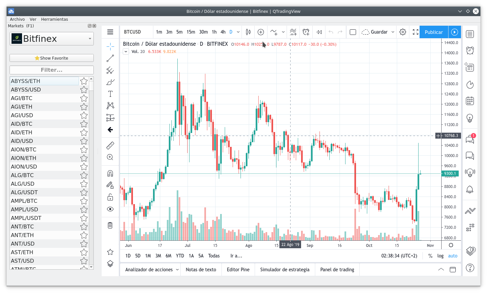

# QTradingView

PyQt App for TradingView.

Recommends simple login to autosave your draws.

---

## Screenshot

---

## Install

- Install from remote
    - `pip install qtradingview`
- Install from local
    - `pip install -e .`

---

## Install from source

###### Prepare environment with Anaconda

- Create and active environment.
    - `conda create -n env_name python=3.7`
    - `conda activate env_name`

- Install PyQt5
    - `conda install -c anaconda pyqt`

- Install dependencies
    - `pip install -r requeriments/linux.txt`

- Run
    - `python app/run.py`

#### Compile

- Install pyinstaller
    - `pip install --upgrade pyinstaller`

- Build
    - `python build.py`

- You can found the binary in '_build/dist'

---

## Developing

#### PyPi Integrate

- Build dist package
    - `python setup.py sdist`

- Upload to PyPi
    - `twine upload --skip-existing  --repository pypi dist/*`